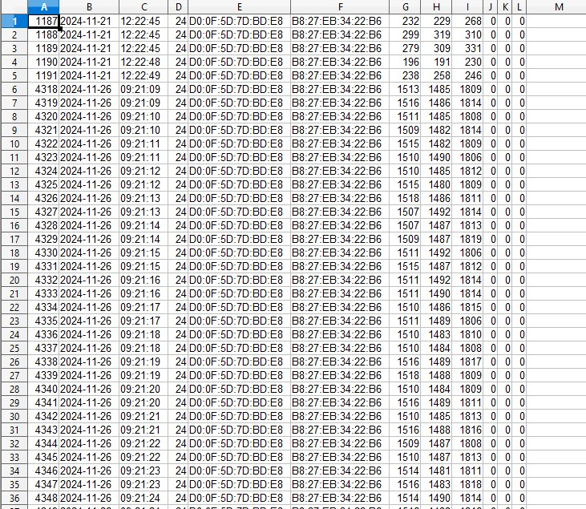
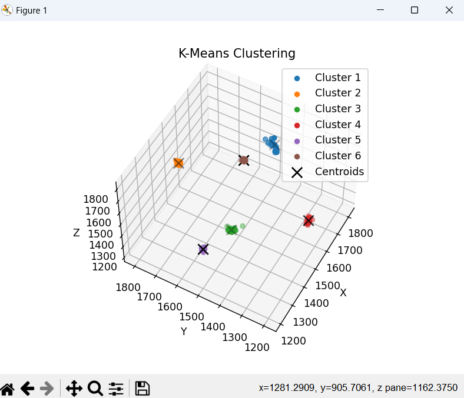
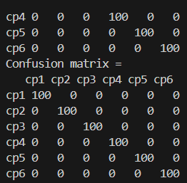

# Tietoliikenteen sovellusprojekti

## Yleiskuvaus

Tässä projektissa hyödynnetään aikasemmilla kursseilla opittuja taitoja. Projektin tarkoituksena on mitata kiihtyvyysanturidataa ja lähettää se Bluetooth LE:llä Raspberry Pi:lle, joka siirtää sen koulun tietokantaan. Tietokannasta data noudetaan omalle tietokoneelle ja toteutetaan K-means-algoritmi mittausten analysoimiseksi. Tämän jälkeen opetettu data siirretään Nordicin alustalle. Lopputuloksella olisi tarkoitus tietää anturin asento.

## Projektin osat

1. **Kiihtyvyysanturidatan kerääminen**  
   - Anturin mittaukset NRF5340DK:n avulla (C-ohjelmointi).
   -

2. **Datan siirto tietokantaan**  
   - Bluetooth LE -yhteydellä Raspberry Pi:lle, josta python-skriptillä tietokantaan.

3. **Datan analyysi ja K-means-opetus**  
   - Datan haku tietokannasta ja opetuksen suorittaminen (Python).
     -

     
4. **Datan lisääminen NRF5340DK**
   - Opetetun datan siirto NRF5340DK-alustalle.
   - Nyt laitteen pitäisi kertoa oma asentonsa nappia painamalla
     Toimii:
   -

## Toteutuksessa käytettävät osa-alueet

- **Kielet**: C, Python, PHP ja Markdown  
- **Laitteet**: Oma kannettava, NRF5340DK-kehitysalusta, GY-61 kiihtyvyysanturi, koulun virtuaalinen linux-palvelin, Raspberry Pi 3B
